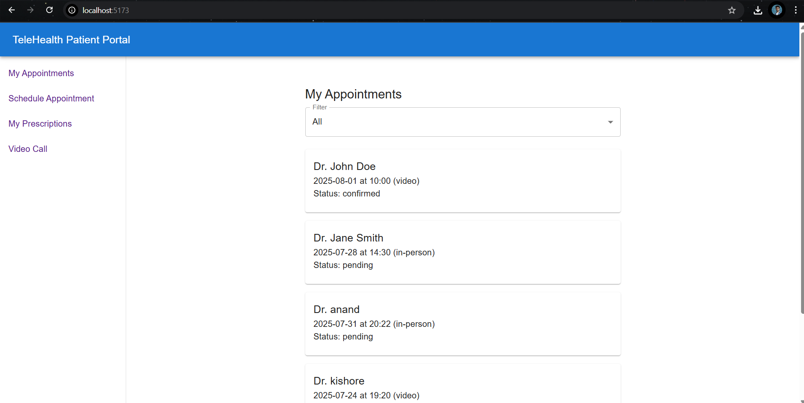
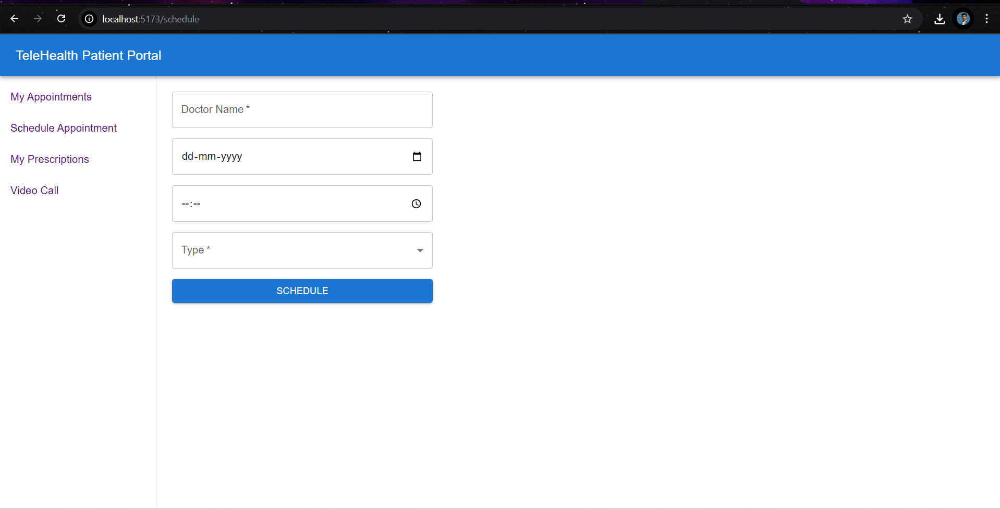
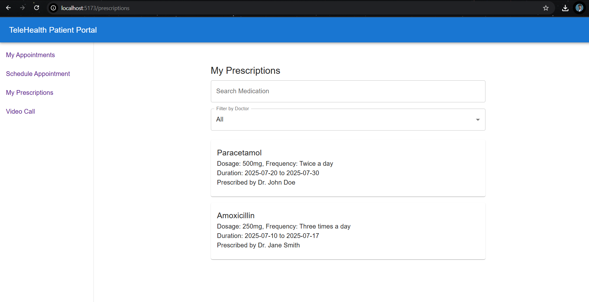
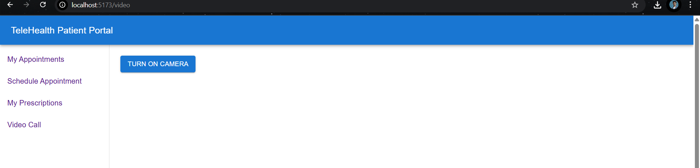

# 🩺 TeleHealth Patient Portal

A simple web-based frontend application for patients to manage their appointments and view prescriptions. Built using **React**, **Material UI**, and a **mock Express backend** for API simulation.

---

## 📁 Project Structure

```
telehealth-patient-portal/
│
├── server/ # Mock Express server
│ └── server.js
│
├── frontend/ # React + Vite frontend
│ ├── src/
│ │ ├── pages/ # Page components
│ │ │ ├── MyAppointments.jsx
│ │ │ ├── MyPrescriptions.jsx
│ │ │ ├── ScheduleAppointment.jsx
│ │ │ └── VideoCall.jsx
│ │ ├── App.jsx # Main App component with routing
│ │ └── index.jsx # Entry point for rendering the app
│ ├── .env # Environment variables
│ ├── .eslintrc.json # ESLint configuration
│ └── .prettierrc # Prettier configuration
```

---

## 🚀 How to Set Up and Run

### 1. Clone the repository

```bash
git clone https://github.com/yourusername/telehealth-portal.git
cd telehealth-portal
```

### 2. Start the Backend

```bash
cd server
npm install
npm start
```

- Starts mock Express server at: `http://localhost:5000`

### 3. Start the Frontend

```bash
cd ../frontend
npm install
npm run dev
```

- Starts frontend on: `http://localhost:5173`

---


## ⚙️ Environment Variables

In `frontend/.env`:

```env
VITE_API_URL=http://localhost:5000
```

You can copy `.env.example` as:

```bash
cp .env.example .env
```

---

## 🛠️ Tools & Libraries Used

### 🔹 Frontend (React)
| Library         | Purpose                                      |
|----------------|----------------------------------------------|
| React           | UI library                                   |
| Material UI     | Pre-built styled components                  |
| React Router    | Page navigation                              |
| Vite            | Faster dev/build tooling                     |
| dotenv          | Manage environment variables                 |
| react-toastify  | Toast notifications for form success/error   |

### 🔹 Backend (Express.js)
| Library  | Purpose                               |
|----------|---------------------------------------|
| Express  | Lightweight API server                |
| CORS     | Enables frontend-backend communication |
| nodemon  | Auto restart during development       |

---

## ✅ Features

- 📅 View upcoming and past appointments
- 💊 View prescriptions with search and filter
- 📝 Schedule new appointments
- 🔍 Filter appointments by date or doctor
- ✅ Toast feedback on successful scheduling

---

## 📌 Assumptions & Limitations

- No database; all data is stored in-memory (lost on restart)
- No authentication/authorization implemented
- For demo/testing purposes only (not production-ready)
- Only basic validation is done client-side

---

## 📷 Screenshots

> *(Add screenshots here to showcase UI)*






---

## 📄 License

This project is licensed under the [MIT License](LICENSE).

---
